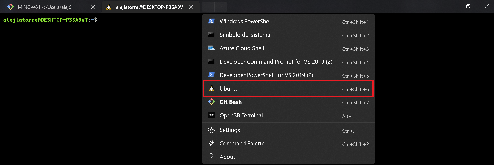
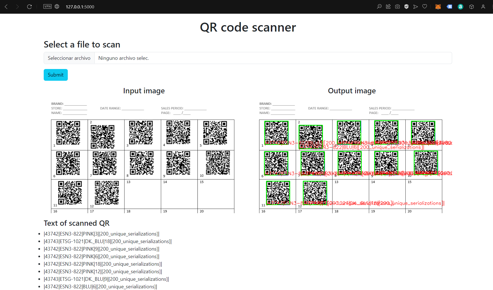
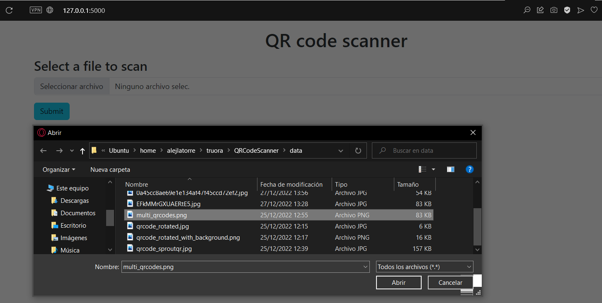
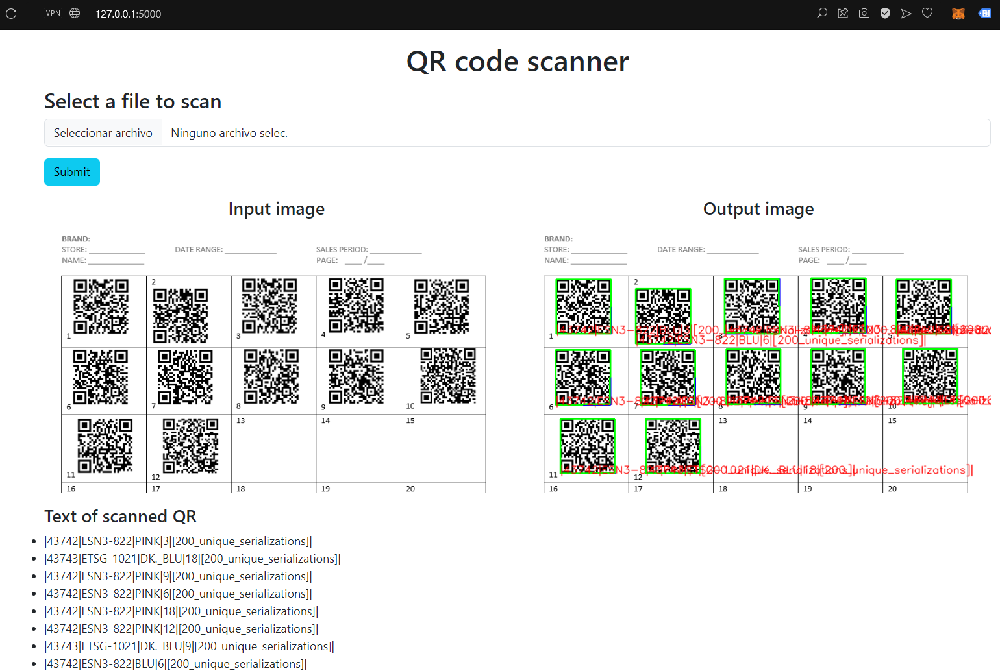
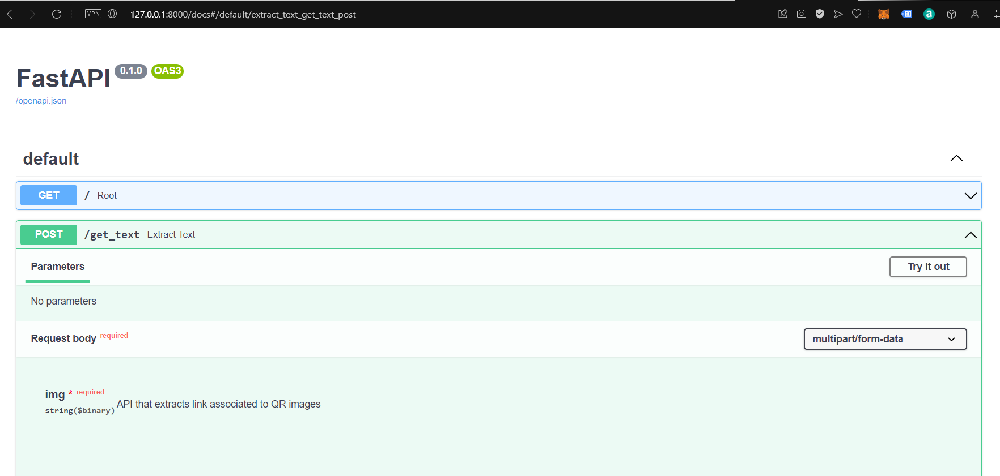
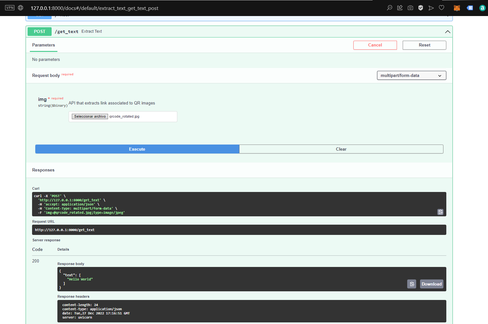
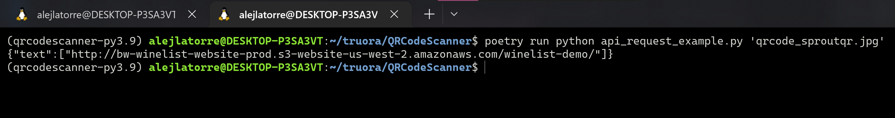
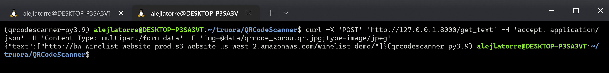

<h1 aling="center"> QR Code Scanner </h1>

This repository contains an API which extracts QR codes from images and scans the content. Also have the web app local version.

**PLEASE: read everything**

--

- [Dev enviroment setup](#dev-enviroment-setup)
- [Web App](#web-app)
- [API call](#api-call)
  - [Test in FastAPI UI](#test-in-fastapi-ui)
  - [Test with a python script in WSL CLI](#test-with-a-python-script-in-wsl-cli)
  - [Test with a cURL script in WSL CLI](#test-with-a-curl-script-in-wsl-cli)

--

## Dev enviroment setup

**This repo only works locally with Windows WSL2 and Linux.**

You need to install some dependencies (if you are in Windows):

- Install [Windows terminal](https://apps.microsoft.com/store/detail/windows-terminal/9N0DX20HK701). This makes easier to switch between Windows and WSL (Windows Substystem in Linux) terminal
- Install Ubuntu with [WSL](https://learn.microsoft.com/en-us/windows/wsl/install)

### Inside WSL terminal

With Windows terminal you must open a new terminal inside WSL (Ubuntu):



### Setup script

- Clone this repository

```
git clone git@github.com:alejlatorre/QRCodeScanner.git
```

- Inside the `scripts` folder run the config file

```
cd scripts/
chmod +x setup.sh
bash setup.sh
```

- After you run the `setup.sh` config file, you must locate on the code folder

```
cd ~/truora/QRCodeScanner
```

- Activate enviroment

```
source .venv/bin/activate
```

## Web app



### Deploy

1. Kill ports if they are in use by another program.

```
sudo lsof -t -i tcp:5000 | xargs kill -9
```

2. Run the program with [poetry](https://python-poetry.org)

```
poetry run python web_app.py
```

3. Open http://127.0.0.1:5000

- Usage:
  - Select a file stored in `data/` folder
    
  - Click on **submit**
    
  - The input/output images and the extracted text will be shown
  - Test with more files. It also manages rotated QRs and images with multiple QR codes

## API call

1. Kill ports if they are in use by another program.

```
sudo lsof -t -i tcp:8000 | xargs kill -9
```

2. Run the program with [uvicorn](https://www.uvicorn.org)

```
uvicorn api:app --reload
```

### Test in FastAPI UI

- Enter into [FastAPI UI](http://127.0.0.1:8000/docs#/default/extract_text_get_text_post)
  

- Usage:
  - Click on `Try it out`
  - Select a file
  - Click on `Execute`
  - The response body will be shown
    

### Test with a python script in WSL CLI

- Run `api_request_example.py` script with an image stored in `data/` folder

```
poetry run python api_request_example.py 'qrcode_sproutqr.jpg'
```



### Test with a cURL script in WSL CLI

- Run the script with an image stored in `data/` folder

```
curl -X 'POST' 'http://127.0.0.1:8000/get_text' -H 'accept: application/json' -H 'Content-Type: multipart/form-data' -F 'img=@data/qrcode_sproutqr.jpg;type=image/jpeg'
```


